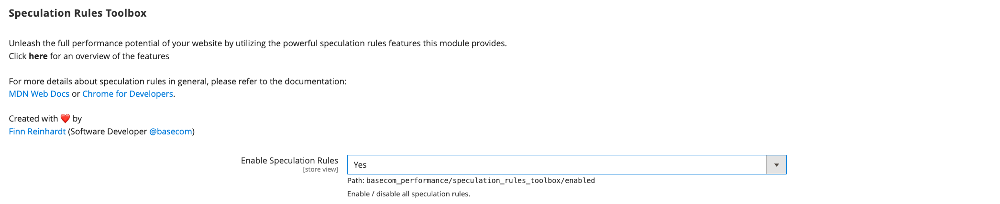
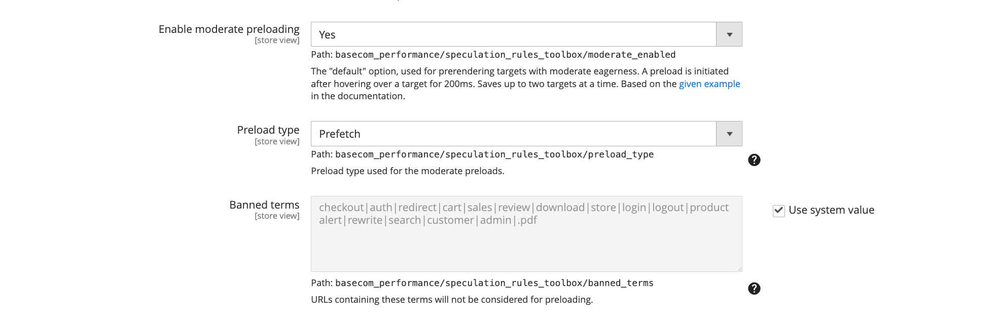
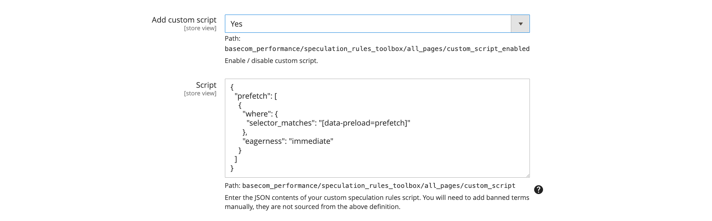
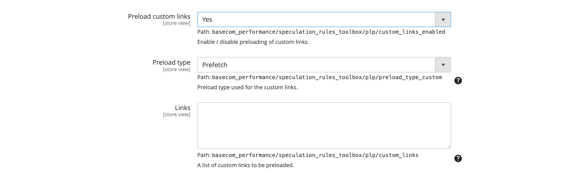
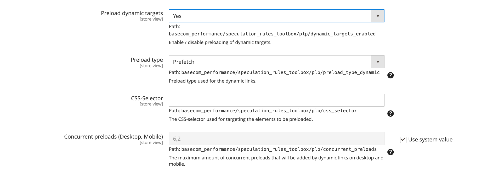
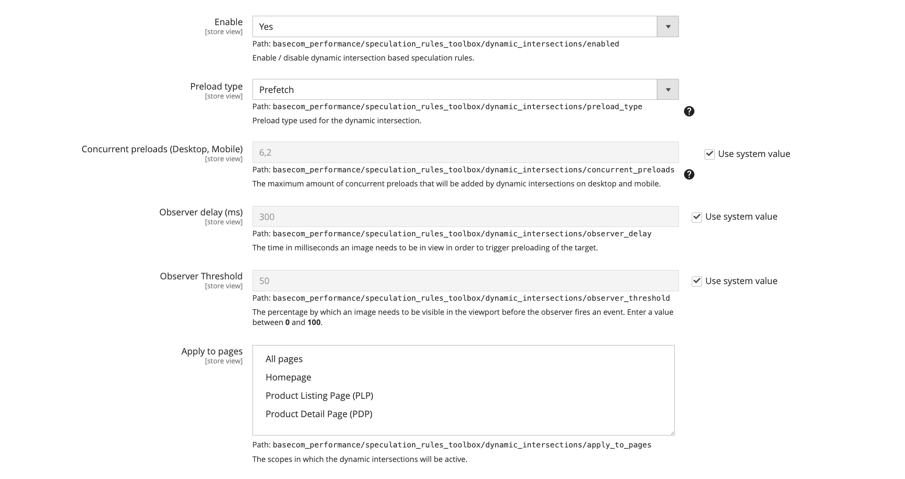

# Basecom_SpeculationRulesToolbox Module

<div align="center">

[![Packagist][ico-version]][link-packagist]
[![Software License][ico-license]](LICENSE)
![Supported Magento Versions][ico-compatibility]

</div>

---
> [!WARNING]  
> Speculation Rules are still an experimental browser feature. Check the
> [browser compatibility table](https://developer.mozilla.org/en-US/docs/Web/API/Speculation_Rules_API#browser_compatibility)
> to see which browsers support it.
> Browser compatibility is ensured in this module by running a check before any scripts are appended to the DOM.
> Browser extensions (such as AdBlockers) can block execution.

Unleash the full potential of your website's performance with the ⚡ **<span style="color: #e8b323;">Speculationrules
Toolbox</span>** ⚡<br><br>
This module provides extensive functionality for utilizing the **Speculation Rules API** (
see [MDN Web Docs](https://developer.mozilla.org/en-US/docs/Web/API/Speculation_Rules_API)
and [Chrome for Developers](https://developer.chrome.com/docs/web-platform/prerender-pages)).
Speculation rules can vastly improve the core web vitals of a website, by allowing for very fast or even instant
pageloads.
This is achieved by preloading relevant resources and links in advance, before the users navigates to them.

Super fast and easy to configure - with just a few clicks you can add your own custom script or utilize the powerful
features of this module. Such as dynamically loading links based on a CSS-selector, a list of static custom links, or
utilizing
the [Intersection Observer API](https://developer.mozilla.org/en-US/docs/Web/API/Intersection_Observer_API)
to identify relevant link targets based on images in view.

> [!NOTE]
> In the context of this module, the term "preload" always refers to "speculative loading". Thus, "preload type"
> infers "speculative loading type".
> The two preload types available
> are [prefetch](https://developer.mozilla.org/en-US/docs/Web/API/Speculation_Rules_API#using_prefetching)
> and [prerender](https://developer.mozilla.org/en-US/docs/Web/API/Speculation_Rules_API#using_prerendering).

## Installation

1. Install the module via composer

    ```console
    composer require basecom/magento2-speculation-rules-toolbox
    ```

2. Enable the module

    ```console
    bin/magento module:enable Basecom_SpeculationRulesToolbox
    bin/magento setup:upgrade
    ```

## Configuration

The module can be enabled and configured
under `Stores > Configuration > Basecom > Performance > Speculation Rules Toolbox > Enable Speculation Rules`. If this
setting is
not enabled, no preloading will occur. It is used in the layout.xml to render the parent block.

The configurations have been carefully selected to allow for fast and simple setup, while also providing enough freedom
for customization.



<hr>

There are a total of five different preload strategies that can be configured:

* [Moderate preloading](#moderate-preloading)
* [Custom script](#custom-script)
* [Custom links](#custom-links)
* [Dynamic links](#dynamic-links)
* [Dynamic Intersections](#dynamic-intersections)

These strategies will be explained in more detail below.

> [!NOTE]  
> Some of these strategies will apply to **all pages** that you visit, while others can be configured individually for
> the **Homepage**,
> Product Listing Page (**PLP**) & Search, as well as the Product Detail Page (**PDP**). These settings are facilitated
> in their respective group.

### Moderate Preloading

Preload links based on the user behavior.

Adds a predefined speculation rules script. Preloads are triggered when the user hovers over a link for more than 200ms.
This functionality is only available on desktop devices, as mobile users cannot provide the hover input.
This is a quick and easy setting you can enable in the beginning, to improve the performance for desktop users.
This is the equivalent to Hyva's implementation, which can be enabled under
`Stores > Configuration > Hyva Themes > Experimental > Experimental Features > Enable Prerender Speculation Rules`.
However, the Hyva implementation requires changes to the .phtml-template to modify the logic.



Enable: `basecom_performance/speculation_rules_toolbox/moderate_enabled`

| **Configurable for** | `All pages` |
|----------------------|-------------|
| **Eagerness**        | `Moderate`  |

> [!TIP]  
> Setting the preload type to "prerender" provides a great synergy when used in combination with prefetching other
> targets.

### Custom Script

Add your own custom speculation rules script to all pages.

This is mainly intended to allow for customization of missing, desired functionality. For example, you could implement
your own prefetch / prerender rules based on custom data-attributes.



Enable: `basecom_performance/speculation_rules/all_pages/custom_script_enabled`

| **Configurable for** | `All pages`                            |
|----------------------|----------------------------------------|
| **Eagerness**        | Can be configured in the custom script |

### Custom Links

Upon pageload, preload a user defined list of links.

Useful for providing relevant resources to the user early.



Enable (Scope): `basecom_performance/speculation_rules_toolbox/{{ scope }}/custom_links_enabled`

| **Configurable for** | `All pages`,`Homepage`,`PLP`,`PDP` |
|----------------------|------------------------------------|
| **Eagerness**        | `Immediate`                        |

### Dynamic Links

Upon pageload, dynamically preload link targets based on a user defined CSS-selector.

If the provided CSS-selector already queries a-elements, then these will be used to extract the hrefs for preloads.
Alternatively you can provide a CSS-selector for any other element. The script will query the first result and look
for a-elements inside manually.

Use the `concurrent_preloads` setting to configure the maximum concurrent preloads for desktop and mobile devices.
You may want to select a lower value for mobile devices, as their bandwidth and mobile data is limited.
Depending on the `concurrent_preloads` value for the selected device, the preloads will be limited.



> [!TIP]  
> For a quick and effective setup, use a CSS-selector that targets a product list container. This allows you to preload
> the first products, which the user is likely to navigate to, if the recommendation is useful.

Enable (Scope): `basecom_performance/speculation_rules_toolbox/{{ scope }}/dynamic_links_enabled`

| **Configurable for** | `Homepage`,`PLP`,`PDP` |
|----------------------|------------------------|
| **Eagerness**        | `Immediate`            |

---

### Dynamic Intersections

Create new rules dynamically based on the visible images on the page.

Adds an observer to the page that checks for visible images in the viewport. If an image crosses the user defined
threshold
(in regard to both its visibility and the duration of visibility), the href is extracted and a preload is initiated.
The observer only considers images which are either direct or indirect ancestors of an
anchoir-element (`<a href="...">`).

Use the `concurrent_preloads` setting to configure the maximum concurrent preloads for desktop and mobile devices.
You may want to select a lower value for mobile devices, as their bandwidth and mobile data is limited.

When an image intersection is detected, the script attempts to add a new script with the respective link target to the
DOM.
This is necessary, because we want more recent preloads to overrule existing ones, as the user is more likely to
navigate to an element that is directly in view.
If the amount of existing scrips is below the `concurrent_preloads` value for the selected device, the script is simply
appended to the DOM.
If the amount of existing scripts has reached the `concurrent_preloads` value for the selected device, the oldest entry
is removed (based on the **F**irst **I**n, **F**irst **O**ut = **FIFO**-principle)
and the new script is added to the DOM. The eagerness of `immediate` ensures that no user interaction is needed to
initiate the preload.



Enable: `basecom_performance/speculation_rules_toolbox/dynamic_intersections/enabled`

| **Configurable for** | `All pages`,`Homepage`,`PLP`,`PDP` |
|----------------------|------------------------------------|
| **Eagerness**        | `Immediate`                        |

## Contributing

Please see [CONTRIBUTING](CONTRIBUTING.md) for details.

## Security

If you discover any security related issues, please email <magento@basecom.de> instead of using the issue tracker.

## License

Licensed under the [MIT](LICENSE) license.

## Copyright

basecom GmbH & Co. KG

[ico-version]: https://img.shields.io/packagist/v/basecom/magento2-speculation-rules-toolbox.svg?style=flat-square

[ico-license]: https://img.shields.io/badge/license-MIT-brightgreen.svg?style=flat-square

[ico-compatibility]: https://img.shields.io/badge/magento-2.4-brightgreen.svg?logo=magento&longCache=true&style=flat-square

[link-packagist]: https://packagist.org/packages/basecom/magento2-speculation-rules-toolbox
